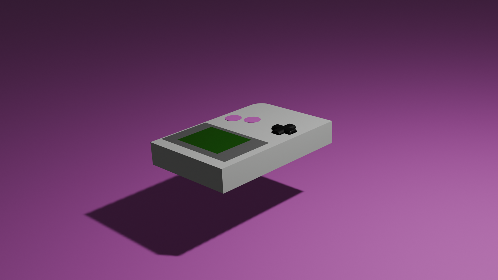

# Présentation du Projet | Project Presentation

## FR :

Ce projet consiste en la modélisation 3D d'une Gameboy réalisée avec Blender. C'est un projet personnel visant à recréer ce classique du jeu vidéo sous forme de modèle 3D détaillé, en prêtant attention aux détails comme les boutons, l'écran et le design rétro emblématique.

### Comment Utiliser

1. Clonez le dépôt sur votre machine locale.
2. Assurez-vous d'avoir Blender installé sur votre machine.
3. Ouvrez le fichier `gameboy.blend` dans Blender.
4. Explorez le modèle et modifiez-le selon vos besoins.

### Technologies Utilisées

- Blender

## ENG :

This project is a 3D model of a Gameboy created using Blender. It’s a personal project aimed at recreating this iconic video game console as a detailed 3D model, focusing on aspects like the buttons, screen, and its classic retro design.

### How to Use

1. Clone the repository to your local machine.
2. Make sure you have Blender installed on your machine.
3. Open the `gameboy.blend` file in Blender.
4. Explore the model and modify it as needed.

### Technologies Used

- Blender

---

## Ce que j'ai appris | What I Learned

## FR :

Grâce à ce projet, j'ai amélioré mes compétences en modélisation d'objets électroniques dans Blender. J'ai appris à travailler avec des formes précises et des détails, à gérer les textures et à rendre des matériaux comme le plastique et l'écran en verre. Ce projet m'a aussi permis de mieux comprendre les principes du design industriel en 3D.

## ENG :

Through this project, I improved my skills in modeling electronic devices in Blender. I learned to work with precise shapes and intricate details, handle textures, and render materials like plastic and glass for the screen. This project also gave me a deeper understanding of 3D industrial design principles.

---

## Auteur | Author

- [Nassim EL HADDAD](https://www.linkedin.com/in/nassim-el-haddad-4aa298271/)

---

### Liens Utiles | Useful Links

- [Blender](https://www.blender.org/)

---

### Image

